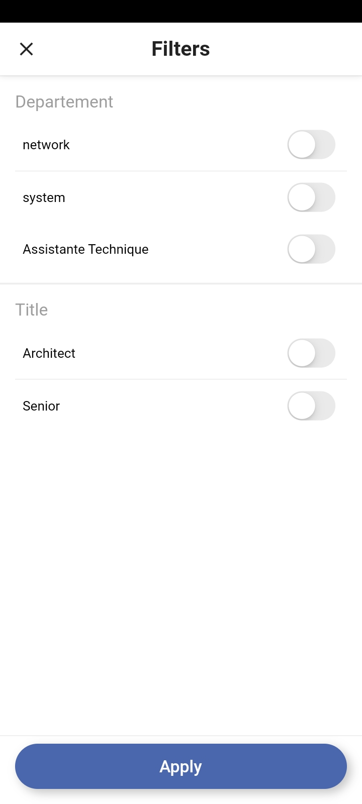
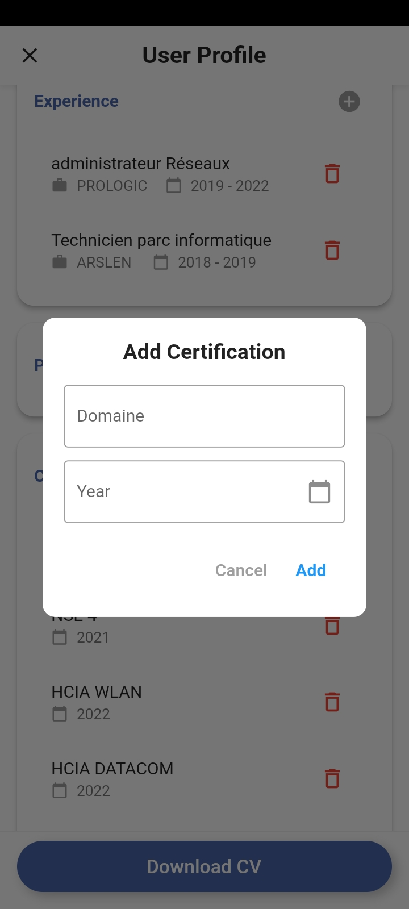
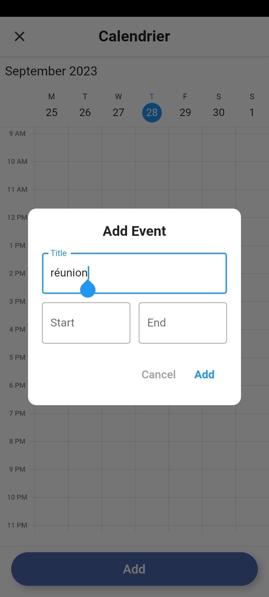
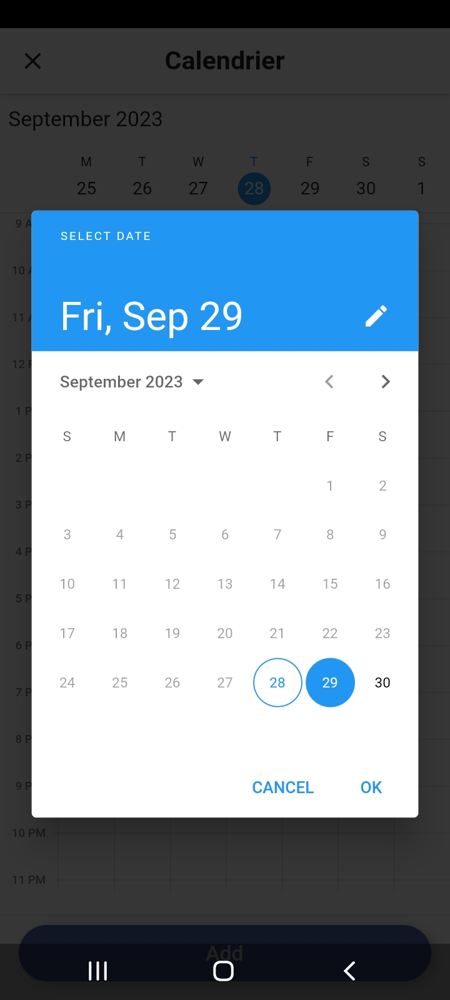

<h1 align="center"> PTE 📱 </h1>
🚀 Transforming an Angular web application into a user-friendly mobile application to enhance the overall user experience. 🌟
 
<h1 align="center"> Screenshot </h1>
 

<table align="center">
  <tr>
    <td></td>
    <td></td>
    <td></td>
    <td></td>
    <td></td>
  </tr>
  <tr>
    <td></td>
    <td></td>
    <td></td>
    <td></td>
    <td></td>
  </tr>
  <tr>
    <td></td>
    <td></td>
    <td></td>
    <td></td>
    <td></td>
  </tr>
  <tr>
    <td></td>
    <td></td>
    <td></td>
    <td></td>
    <td></td>
  </tr>
  <tr>
    <td></td>
    <td></td>
    <td></td>
    <td></td>
    <td></td>
  </tr>
  <tr>
    <td></td>
    <td></td>
    <td></td>
    <td></td>
    <td></td>
  </tr>
  <tr>
    <td></td>
    <td></td>
    <td></td>
    <td></td>
    <td></td>
  </tr>
  <tr>
    <td></td>
    <td></td>
    <td></td>
    <td></td>
    <td></td>
  </tr>
  <tr>
    <td></td>
    <td></td>
    <td></td>
    <td></td>
  </tr>
</table>

(<a href="#top">back to top</a>)

<h2>🌟Star this repository🌟</h2>

Please ⭐️ this repo and share it with others

 

    

  
    

This project is licensed under the **View-Only License**. See the [LICENSE](LICENSE) file for details.

(<a href="#top">back to top</a>)

